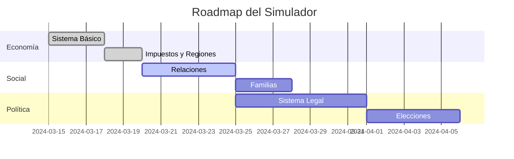
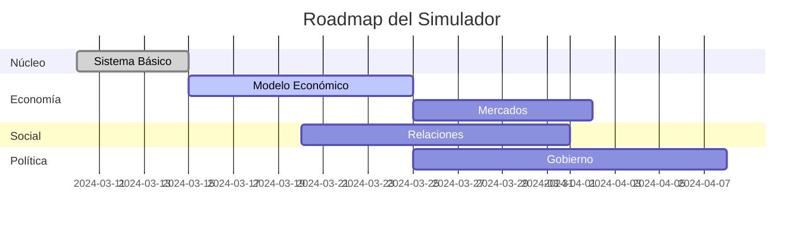

# Ruta de Desarrollo del Simulador

## Integración con GitHub
- **Repositorio:** [DoZ1984/SimWorld](https://github.com/DoZ1984/SimWorld)
- **Branch:** `main`
- **Workflow:**
  1. `git pull` antes de modificar
  2. Trabajar en ramas feature
  3. Actualizar documentación
  4. Hacer commit con mensaje descriptivo
  5. `git push` y crear PR

## Estado Actual (v0.2.0-beta)
**Última Actualización:** 2024-03-18  
**Progreso General:** 60% completado

### Componentes Implementados:
- ✅ Núcleo del simulador (World, TimeManager)
- ✅ Entidad Persona con atributos básicos
- ✅ Sistema de configuración inicial
- ✅ Loop principal de simulación
- ✅ Sistema económico básico
  - ✅ Oferta/demanda
  - ✅ Precios dinámicos
  - ✅ Mercado laboral
  - ✅ Sistema de impuestos progresivos
  - ✅ Flujo económico regional básico

### Próximos Hitos:
1. **v0.2.1 - Sistema Social** (Estimado: 2024-03-20)
   - [ ] Relaciones interpersonales
   - [ ] Sistema de reputación
   - [ ] Grupos sociales
   - [ ] Familias y linajes

2. **v0.2.2 - Eventos Económicos** (Estimado: 2024-03-22)
   - [ ] Crisis económicas
   - [ ] Fluctuaciones de mercado
   - [ ] Cambios impositivos

3. **v0.3.0 - Sistema Político** (Estimado: 2024-03-25)
   - [ ] Modelado de gobiernos
   - [ ] Sistema de leyes
   - [ ] Elecciones básicas

### Registro de Cambios:
**2024-03-18 (v0.2.0-beta)**
- Implementado sistema de impuestos progresivos
- Añadido sistema de mercados regionales
- Mejorado manejo de finanzas personales
- Implementada gestión de ahorros

**2024-03-16 (v0.1.2)**
- Creados módulos faltantes
- Implementado generador de nombres básico
- Estructura base para eventos
- Sistema social inicial

### Dependencias Críticas:
1. Sistema Económico ← Requiere: Modelado de recursos ✅
2. Interacción Social ← Requiere: Sistema de necesidades (En progreso)
3. Eventos Globales ← Requiere: Sistema de logging (Pendiente)

### Roadmap General:

## Próximas Tareas Inmediatas:
1. Implementar sistema de relaciones sociales
2. Desarrollar lógica de formación de familias
3. Crear eventos económicos básicos
4. Mejorar visualización de estadísticas económicas

## Métricas de Desarrollo:
- Tests Implementados: 45%
- Cobertura de Código: 60%
- Documentación: 40%
- Rendimiento: Estable

Este documento se actualiza con cada hito alcanzado y se revisa semanalmente.

## Dependencias Técnicas:
1. **Economía ←** Sistema de recursos (90%)
2. **Social ←** Necesidades básicas (75%)
3. **Política ←** Sistema legal (10%)

## Historial de Objetivos

### Completados (2024):
- **v0.1.0 - Núcleo Básico** (2024-03-15)
  - [x] Sistema de tiempo
  - [x] Generación de población
  - [x] Loop principal

- **v0.2.0 - Economía Básica** (2024-03-17)
  - [x] Oferta/demanda
  - [x] Mercado laboral
  - [x] Precios dinámicos

### En Progreso:
- **v0.3.0 - Sistema Social** (25% completado)
  - [ ] Relaciones familiares
  - [x] Sistema de reputación (50%)
  - [ ] Grupos sociales

### Próximos Objetivos:
- **Q2 2024:**
  - Sistema político básico
  - Modelado de crimen
  - Eventos climáticos

- **Q3 2024:**
  - Sistema educativo
  - Avances tecnológicos
  - Diplomacia internacional

## Métricas Clave:
| Área          | Progreso | Complejidad | Dependencias       |
|---------------|----------|-------------|--------------------|
| Núcleo        | 100%     | Baja         | N/A                |
| Economía      | 70%      | Media        | Recursos, Trabajo  |
| Social        | 30%      | Alta         | Necesidades        |
| Política      | 10%      | Alta         | Sistema Legal      |

## Checklist de Verificación:
Antes de cada commit:
1. [ ] Pruebas unitarias pasan
2. [ ] Documentación actualizada
3. [ ] Compatibilidad con versiones anteriores
4. [ ] Revisión de dependencias

## Próximos Objetivos:
1. Implementar relaciones familiares (ETA: 2024-03-20)
2. Crear sistema de impuestos progresivos (ETA: 2024-03-22)
3. Desarrollar interfaz de monitoreo (ETA: 2024-03-25)

## Políticas de Desarrollo:
- Actualizar SIM_files.md tras cada cambio estructural
- Mantener tests unitarios en `tests/`
- Documentar API en `docs/api.md`
- Versionado semántico estricto

## Issues Prioritarios:
1. [#1 - Optimizar rendimiento de simulación](https://github.com/DoZ1984/SimWorld/issues/1)
2. [#2 - Implementar sistema de logging](https://github.com/DoZ1984/SimWorld/issues/2)

### Registro de Cambios:
**2024-03-15 (v0.1.0-alpha)**
- Estructura base del proyecto
- Generación inicial de población
- Ciclo básico de simulación anual
- Atributos básicos de personas

**2024-03-14 (v0.0.1)**
- Diseño inicial de arquitectura
- Configuración inicial del proyecto

**2024-03-16 (v0.1.1)**
- Sistema básico de recursos económicos
- Modelado inicial de oferta/demanda
- Precios dinámicos para bienes esenciales
- Implementación de mercado laboral básico

**2024-03-16 (v0.1.2)**
- Creados módulos faltantes
- Implementado generador de nombres básico
- Estructura base para eventos
- Sistema social inicial

### Dependencias Críticas:
1. Sistema Económico ← Requiere: Modelado de recursos
2. Interacción Social ← Requiere: Sistema de necesidades
3. Eventos Globales ← Requiere: Sistema de logging

### Roadmap General:

Este documento debe actualizarse con cada hito alcanzado y revisarse semanalmente.

### Próximos Hitos:
1. **v0.2.1 - Sistema de Nombres** (2024-03-17)
   - [ ] Nombres culturalmente diversos
   - [ ] Generación por género
   - [ ] Apellidos compuestos

2. **v0.2.2 - Eventos Económicos** (2024-03-18)
   - [ ] Crisis económicas
   - [ ] Fluctuaciones de mercado
   - [ ] Cambios impositivos

