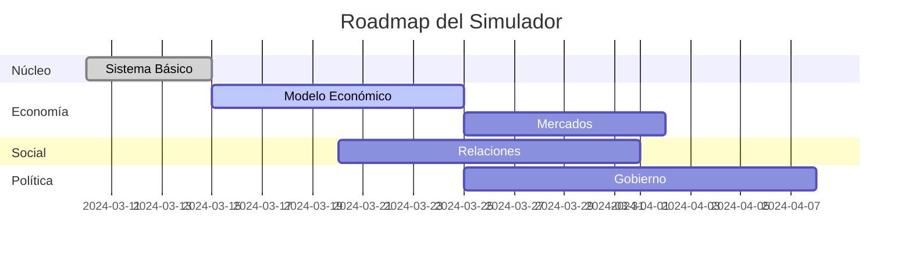

# Ruta de Desarrollo del Simulador

## Estado Actual (v0.1.0-alpha)
**Fecha de Actualización:** 2024-03-15  
**Progreso General:** 40% completado

### Componentes Implementados:
- ✅ Núcleo del simulador (World, TimeManager)
- ✅ Entidad Persona con atributos básicos
- ✅ Sistema de configuración inicial
- ✅ Loop principal de simulación

### Próximos Hitos:
1. **v0.2.0 - Sistema Económico Básico** (Estimado: 2024-03-18)
   - [x] Modelado de oferta/demanda
   - [x] Sistema de precios dinámicos
   - [x] Mercado laboral básico
   - [ ] Sistema de impuestos
   - [ ] Flujo económico regional

2. **v0.3.0 - Interacción Social** (Estimado: 2024-03-25)
   - [ ] Relaciones interpersonales
   - [ ] Sistema de reputación
   - [ ] Grupos sociales

3. **v0.4.0 - Sistema Político** (Estimado: 2024-04-01)
   - [ ] Modelado de gobiernos
   - [ ] Sistema de leyes
   - [ ] Elecciones básicas

### Registro de Cambios:
**2024-03-15 (v0.1.0-alpha)**
- Estructura base del proyecto
- Generación inicial de población
- Ciclo básico de simulación anual
- Atributos básicos de personas

**2024-03-14 (v0.0.1)**
- Diseño inicial de arquitectura
- Configuración inicial del proyecto

**2024-03-16 (v0.1.1)**
- Sistema básico de recursos económicos
- Modelado inicial de oferta/demanda
- Precios dinámicos para bienes esenciales
- Implementación de mercado laboral básico

**2024-03-16 (v0.1.2)**
- Creados módulos faltantes
- Implementado generador de nombres básico
- Estructura base para eventos
- Sistema social inicial

### Dependencias Críticas:
1. Sistema Económico ← Requiere: Modelado de recursos
2. Interacción Social ← Requiere: Sistema de necesidades
3. Eventos Globales ← Requiere: Sistema de logging

### Roadmap General:

Este documento debe actualizarse con cada hito alcanzado y revisarse semanalmente.

### Próximos Hitos:
1. **v0.2.1 - Sistema de Nombres** (2024-03-17)
   - [ ] Nombres culturalmente diversos
   - [ ] Generación por género
   - [ ] Apellidos compuestos

2. **v0.2.2 - Eventos Económicos** (2024-03-18)
   - [ ] Crisis económicas
   - [ ] Fluctuaciones de mercado
   - [ ] Cambios impositivos

